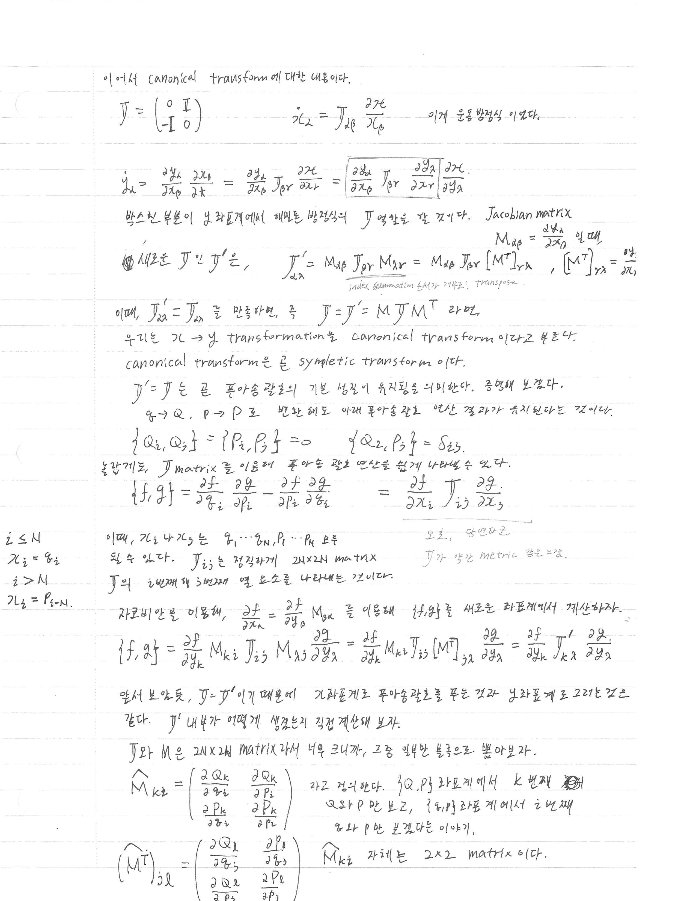
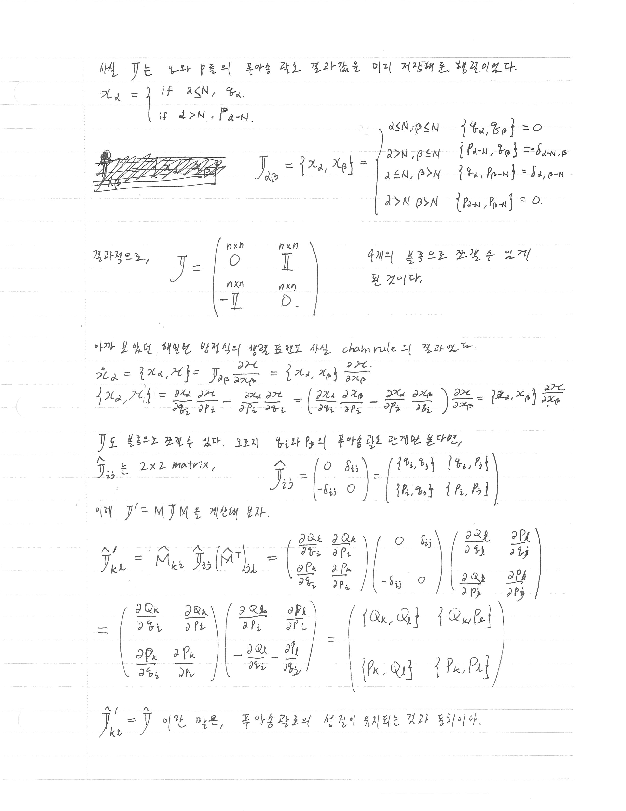
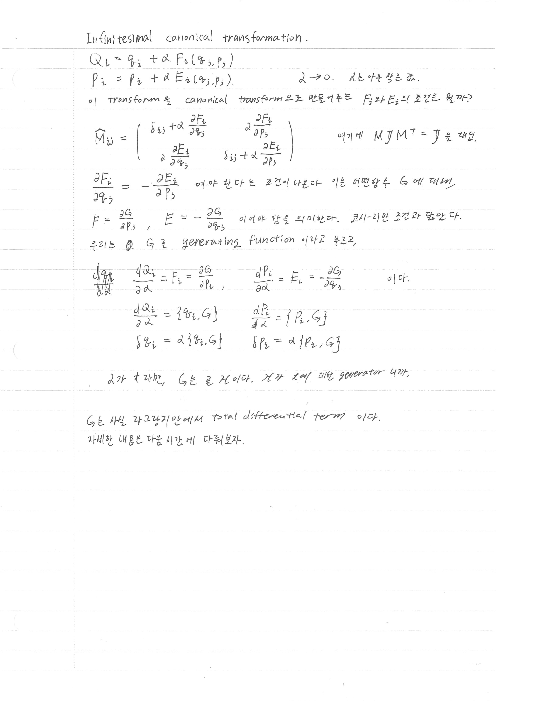

> [!attention] 강의 필기
> 이것은 [[Analytical Mechanics]] 강의를 듣고 적은 필기입니다. 
> 정리가 안 되어 있고, 개인적인 생각과 풀이가 섞여 있을 수도 있습니다. 

# 지난 강의

[[AM lecture note - Liouville theorem and Canonical transformation]]에서 Liouville 정리와 canonical transformation의 기본 개념을 다뤘다.

# 오늘의 핵심

- Canonical transformation의 조건: symplectic matrix $\mathbb{J}$가 보존됨 ($\mathbb{J}' = \mathbb{J}$, 즉 $M \mathbb{J} M^T = \mathbb{J}$)
- Poisson bracket이 canonical transformation 하에서 불변
- Infinitesimal canonical transformation의 generating function $G$

# 필기 내용

## Symplectic 조건과 Canonical Transformation

심플렉틱 행렬을 다음과 같이 정의한다:

$$
\mathbb{J} = \begin{pmatrix} 0 & \mathbb{I} \\ -\mathbb{I} & 0 \end{pmatrix}
$$

Hamilton 운동방정식은 이 행렬로 쓸 수 있다는 것을 저번 시간에 배웠다. 

$$
\dot{\chi}_\alpha = \mathbb{J}_{\alpha\beta} \frac{\partial \mathcal{H}}{\partial \chi_\beta}
$$

여기서 $\chi_i$는 $p$와 $q$모두가 될 수 있으며, index는 1부터 2N 까지이다. 
index가 N보다 작으면 $q$를, 보다 크면 $p$를 나타낸다. 
$\chi_i = q_i$ ($i \leq N$), $\chi_i = p_{i-N}$ ($i > N$).

### 새로운 좌표계로의 변환

$\chi \to y$ 변환 시 운동방정식의 변환:

$$
\dot{y}_\alpha = \frac{\partial y_\alpha}{\partial \chi_\beta} \dot{\chi}_\beta = \frac{\partial y_\alpha}{\partial \chi_\beta} \mathbb{J}_{\beta\gamma} \frac{\partial \mathcal{H}}{\partial \chi_\gamma} = \frac{\partial y_\alpha}{\partial \chi_\beta} \mathbb{J}_{\beta\gamma} \frac{\partial y_\delta}{\partial \chi_\gamma} \frac{\partial \mathcal{H}}{\partial y_\delta}
$$

Jacobian matrix 

$$
M_{\alpha\beta} = \dfrac{\partial y_\alpha}{\partial \chi_\beta}
$$
를 도입하면:

$$
\mathbb{J}'_{\alpha\lambda} = M_{\alpha\beta}\, \mathbb{J}_{\beta\gamma}\, M_{\lambda\gamma} = M_{\alpha\beta}\, \mathbb{J}_{\beta\gamma}\, [M^T]_{\gamma\lambda}
$$

index summation 순서 주의. 
$M_{\lambda\gamma}$는 summation 순서가 반대여서(앞의 ) transpose했다.
$$
[M^T]_{\gamma\lambda} = \dfrac{\partial y_\lambda}{\partial \chi_\gamma}
$$

### Canonical transformation의 정의

$\mathbb{J}'_{\alpha\lambda} = \mathbb{J}_{\alpha\lambda}$를 만족할 때, 즉

$$
\mathbb{J} = M \mathbb{J} M^T
$$

가 성립할 때, $\chi \to y$ 변환을 **canonical transformation** (혹은 **symplectic transformation**)이라 부른다.

---

## Poisson Bracket의 불변성

$\mathbb{J}' = \mathbb{J}$는 Poisson 괄호의 기본 성질이 유지됨을 의미한다. 즉, $q \to Q$, $p \to P$로 변환해도 아래 Poisson 괄호 연산 결과가 유지된다:

$$
\{Q_i, Q_j\} = \{P_i, P_j\} = 0, \qquad \{Q_i, P_j\} = \delta_{ij}
$$

### $\mathbb{J}$ matrix로 Poisson bracket 쓰기

$\mathbb{J}$ matrix를 이용하면 Poisson 괄호를 간결하게 나타낼 수 있다:

$$
\{f, g\} = \frac{\partial f}{\partial q_i} \frac{\partial g}{\partial p_i} - \frac{\partial f}{\partial p_i} \frac{\partial g}{\partial q_i} = \frac{\partial f}{\partial \chi_i} \mathbb{J}_{ij} \frac{\partial g}{\partial \chi_j}
$$

. $\mathbb{J}_{ij}$는 정확히 $2N \times 2N$ matrix $\mathbb{J}$의 $i$번째 행 $j$번째 열 원소를 나타낸다.

> [!note] $\mathbb{J}$는 일종의 metric?
> $\mathbb{J}$는 일반적 metric과는 다른, Poisson structure를 정의하는 antisymmetric bilinear form이다.

### Jacobian을 이용한 새로운 좌표계에서의 Poisson bracket

$$
\{f, g\} = \frac{\partial f}{\partial \chi_\alpha} M_{\beta\alpha}^{-1}\, \mathbb{J}_{\beta\gamma}\, M_{\delta\gamma}^{-1} \frac{\partial g}{\partial y_\delta}
$$

$\dfrac{\partial f}{\partial \chi_\alpha} = \dfrac{\partial f}{\partial y_\alpha} M_{\beta\alpha}$을 이용하면:

$$
\{f, g\} = \frac{\partial f}{\partial y_k} M_{ki}\, \mathbb{J}_{ij}\, M_{\lambda j} \frac{\partial g}{\partial y_\lambda}
$$
$$
= \frac{\partial f}{\partial y_k} M_{ki}\, \mathbb{J}_{ij}\, [M^T]_{j\lambda} \frac{\partial g}{\partial y_\lambda}
$$
$$
= \frac{\partial f}{\partial y_k} \mathbb{J}'_{k\lambda} \frac{\partial g}{\partial y_\lambda}
$$

$$
\boxed{M\, \mathbb{J}\, M^T = \mathbb{J}'}
$$

$\mathbb{J} = \mathbb{J}'$이기 때문에 기존 좌표계로 Poisson 괄호를 푼 결과와 새 좌표계로 푼 결과가 같다.

---

## $\hat{\mathbb{J}}$의 블록 분해

$\mathbb{J}$와 $M$은 $2N \times 2N$ matrix이지만, 그 중 일부만 블록으로 뽑아볼 수 있다.
블록으로 뽑아버린 경우, matrix 위에 $\hat{\cdot}$ 을 씌워 표기하겠다. 

$\hat{M}_{k\ell}$을 다음과 같이 정의한다 ($k, \ell = 1, \ldots, N$):

$$
\hat{M}_{k\ell} = \begin{pmatrix} \dfrac{\partial Q_k}{\partial q_\ell} & \dfrac{\partial Q_k}{\partial p_\ell} \\[6pt] \dfrac{\partial P_k}{\partial q_\ell} & \dfrac{\partial P_k}{\partial p_\ell} \end{pmatrix}
$$

$\{q, p\}$ 좌표계에서 $k$번째 좌표인 $Q_k$와 $P_k$를 보고, $\{q, p\}$ 좌표계에서 $\ell$번째 좌표인 $q_l$과 $p_l$에 대해서만 자코비 행렬을 보겠다는 의도이다. 
$\hat{M}_{k\ell}$ 자체는 $2 \times 2$ matrix이다.
전치 행렬에 대해서도 마찬가지이다. 

$$
(\hat{M}^T)_{j\ell} = \begin{pmatrix} \dfrac{\partial Q_\ell}{\partial q_j} & \dfrac{\partial P_\ell}{\partial q_j} \\[6pt] \dfrac{\partial Q_\ell}{\partial p_j} & \dfrac{\partial P_\ell}{\partial p_j} \end{pmatrix}
$$

사실 $\mathbb{J}$는 $q$와 $p$들의 Poisson 괄호 결과값을 미리 저장해둔 행렬이었다:

$$
\mathbb{J}_{\alpha\beta} = \{\chi_\alpha, \chi_\beta\} = \begin{cases} \{q_\alpha, q_\beta\} = 0 & \alpha \leq N,\, \beta \leq N \\ \{p_{\alpha-N}, q_\beta\} = -\delta_{\alpha-N,\,\beta} & \alpha > N,\, \beta \leq N \\ \{q_\alpha, p_{\beta-N}\} = \delta_{\alpha,\,\beta-N} & \alpha \leq N,\, \beta > N \\ \{p_{\alpha-N}, p_{\beta-N}\} = 0 & \alpha > N,\, \beta > N \end{cases}
$$

결과적으로:

$$
\mathbb{J} = \begin{pmatrix} 0^{n\times n} & \mathbb{I}^{n\times n} \\ -\mathbb{I}^{n\times n} & 0^{n\times n} \end{pmatrix}
$$

(4개의 블록으로 조각낼 수 있게 된 것이다.)

아까 보았던 Hamilton 방정식의 행렬 표현도 사실 chain rule의 결과였다:

$$
\dot{\chi}_\alpha = \{\chi_\alpha, \mathcal{H}\} = \mathbb{J}_{\alpha\beta} \frac{\partial \mathcal{H}}{\partial \chi_\beta} = \{\chi_\alpha, \chi_\beta\} \frac{\partial \mathcal{H}}{\partial \chi_\beta}
$$
Chain rule을 적용하는 과정을 풀어 쓰자면,
$$
\{\chi_\alpha, \mathcal{H}\} = \frac{\partial \chi_\alpha}{\partial q_i} \frac{\partial \mathcal{H}}{\partial p_i} - \frac{\partial \chi_\alpha}{\partial p_i} \frac{\partial \mathcal{H}}{\partial q_i} = \left(\frac{\partial \chi_\alpha}{\partial q_i}\frac{\partial \chi_\beta}{\partial p_i} - \frac{\partial \chi_\alpha}{\partial p_i}\frac{\partial \chi_\beta}{\partial q_i}\right) \frac{\partial \mathcal{H}}{\partial \chi_\beta} = \{\chi_\alpha, \chi_\beta\} \frac{\partial \mathcal{H}}{\partial \chi_\beta}
$$

$\mathbb{J}$도 블록으로 조각낼 수 있다. 오직 $q_i$와 $p_j$의 Poisson 괄호 관계만 본다면, 
$\hat{\mathbb{J}}_{ij}$는 $2 \times 2$ matrix:

$$
\hat{\mathbb{J}}_{ij} = \begin{pmatrix} 0 & \delta_{ij} \\ -\delta_{ij} & 0 \end{pmatrix} = \begin{pmatrix} \{q_i, q_j\} & \{q_i, p_j\} \\ \{p_i, q_j\} & \{p_i, p_j\} \end{pmatrix}
$$

이제 $\mathbb{J}' = M \mathbb{J} M^T$를 계산해 보자:

$$
\hat{\mathbb{J}}'_{k\ell} = \hat{M}_{ki}\, \hat{\mathbb{J}}_{ij}\, (\hat{M}^T)_{j\ell} = \begin{pmatrix} \frac{\partial Q_k}{\partial q_i} & \frac{\partial Q_k}{\partial p_i} \\ \frac{\partial P_k}{\partial q_i} & \frac{\partial P_k}{\partial p_i} \end{pmatrix} \begin{pmatrix} 0 & \delta_{ij} \\ -\delta_{ij} & 0 \end{pmatrix} \begin{pmatrix} \frac{\partial Q_\ell}{\partial q_j} & \frac{\partial P_\ell}{\partial q_j} \\ \frac{\partial Q_\ell}{\partial p_j} & \frac{\partial P_\ell}{\partial p_j} \end{pmatrix}
$$

$$
= \begin{pmatrix} \frac{\partial Q_k}{\partial q_i} & \frac{\partial Q_k}{\partial p_i} \\ \frac{\partial P_k}{\partial q_i} & \frac{\partial P_k}{\partial p_i} \end{pmatrix} \begin{pmatrix} \frac{\partial Q_\ell}{\partial p_i} & \frac{\partial P_\ell}{\partial p_i} \\ -\frac{\partial Q_\ell}{\partial q_i} & -\frac{\partial P_\ell}{\partial q_i} \end{pmatrix} = \begin{pmatrix} \{Q_k, Q_\ell\} & \{Q_k, P_\ell\} \\ \{P_k, Q_\ell\} & \{P_k, P_\ell\} \end{pmatrix}
$$

$\hat{\mathbb{J}}' = \hat{\mathbb{J}}$은, 즉 심플레틱 행렬이 유지되는 것은 **Poisson 괄호의 성질이 유지되는 것과 동치**이다.

---

## Infinitesimal Canonical Transformation

아주 작은 좌표계 변화를 만드는 canonical transformation을 생각한다:

$$
Q_i = q_i + \alpha F_i(q_j, p_j)
$$

$$
P_i = p_i + \alpha E_i(q_j, p_j)
$$

$\alpha$는 아주 작은 수, 변환이 얼마나 일어났는가의 척도. 

이 변환이 canonical transformation이 되려면 $F_i$와 $E_i$이 어떤 조건을 갖추어야 하는가?

$$
\hat{M}_{ij} = \begin{pmatrix} \delta_{ij} + \alpha\dfrac{\partial F_i}{\partial q_j} & \alpha\dfrac{\partial F_i}{\partial p_j} \\[6pt] \alpha\dfrac{\partial E_i}{\partial q_j} & \delta_{ij} + \alpha\dfrac{\partial E_i}{\partial p_j} \end{pmatrix}
$$

여기서 $M \mathbb{J} M^T = \mathbb{J}$를 적용하면 조건이 나온다:

$$
\frac{\partial F_i}{\partial q_j} = -\frac{\partial E_j}{\partial p_i}
$$

이는 어떤 함수 $G$에 대해,

$$
F = \frac{\partial G}{\partial p_j}, \qquad E = -\frac{\partial G}{\partial q_j}
$$

이어야 함을 의미한다. 이는 **코시-리만 조건**과 닮아 있다.

우리는 $G$를 **generating function**이라고 부르며:

$$
\frac{dQ_i}{d\alpha} = F_i = \frac{\partial G}{\partial p_i}, \qquad \frac{dP_i}{d\alpha} = E_i = -\frac{\partial G}{\partial q_i}
$$

이다. Poisson bracket 형태로 쓰면:

$$
\frac{dQ_i}{d\alpha} = \{q_i, G\}, \qquad \frac{dP_i}{d\alpha} = \{p_i, G\}
$$

따라서 위상 공간에서의 변분은:

$$
\delta q_i = \alpha\{q_i, G\}, \qquad \delta p_i = \alpha\{p_i, G\}
$$

$\alpha$가 $t$라면, $G$는 곧 $\mathcal{H}$이다. **$\mathcal{H}$가 시간에 대한 generator**가 된다.

> [!note] Generating function의 물리적 의미
> $G$는 사실 라그랑지안에서 total differential term이다. 자세한 내용은 다음 시간에 다룬다.

---

# 궁금한 내용

- $G$가 라그랑지안의 total differential term이라는 것은 구체적으로 무슨 의미인가?
- Canonical transformation의 generating function에는 어떤 종류가 있는가? (Type 1, 2, 3, 4?)

# AI의 보충 설명

# 연관 학습 노트

# References

David Tong, *Classical Dynamics* (Cambridge lecture notes)

# 다음 강의

# 필기 원본

[[AM_5thweek_2.pdf]]

---

## 필기 스캔본 이미지

