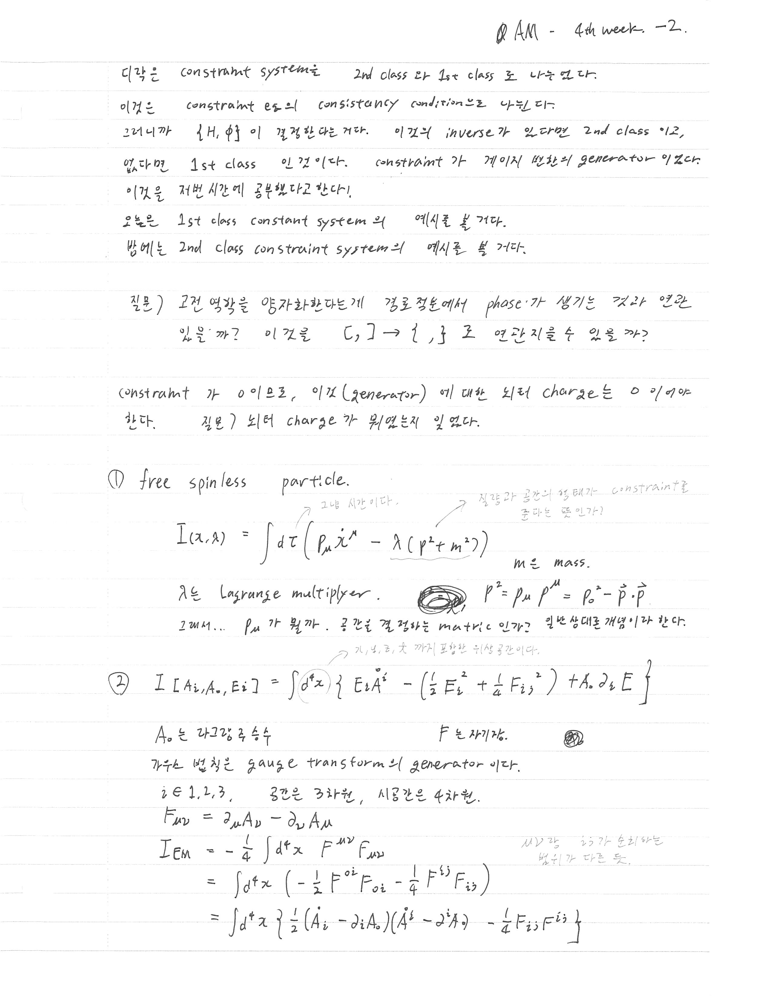
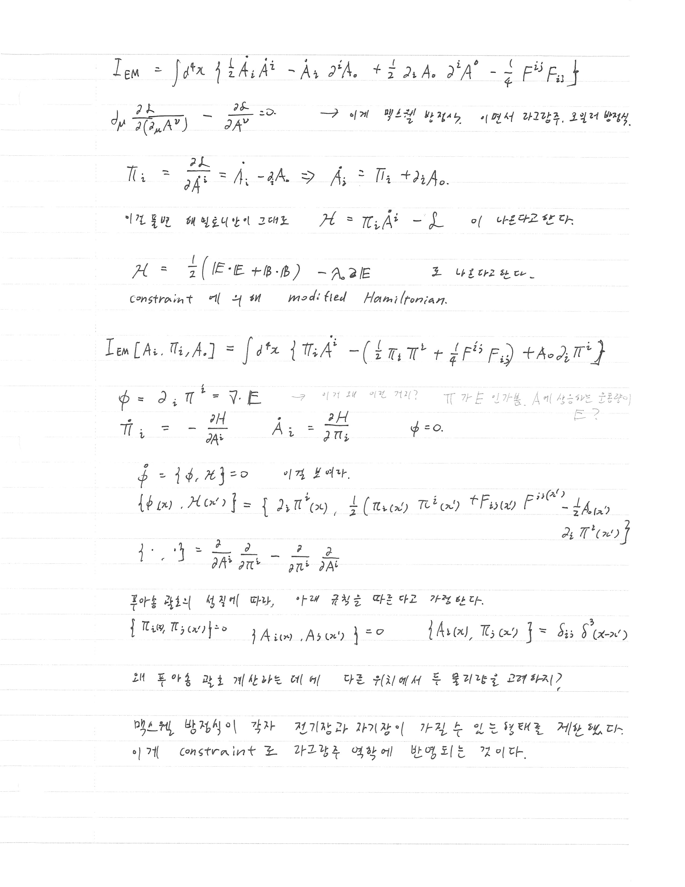
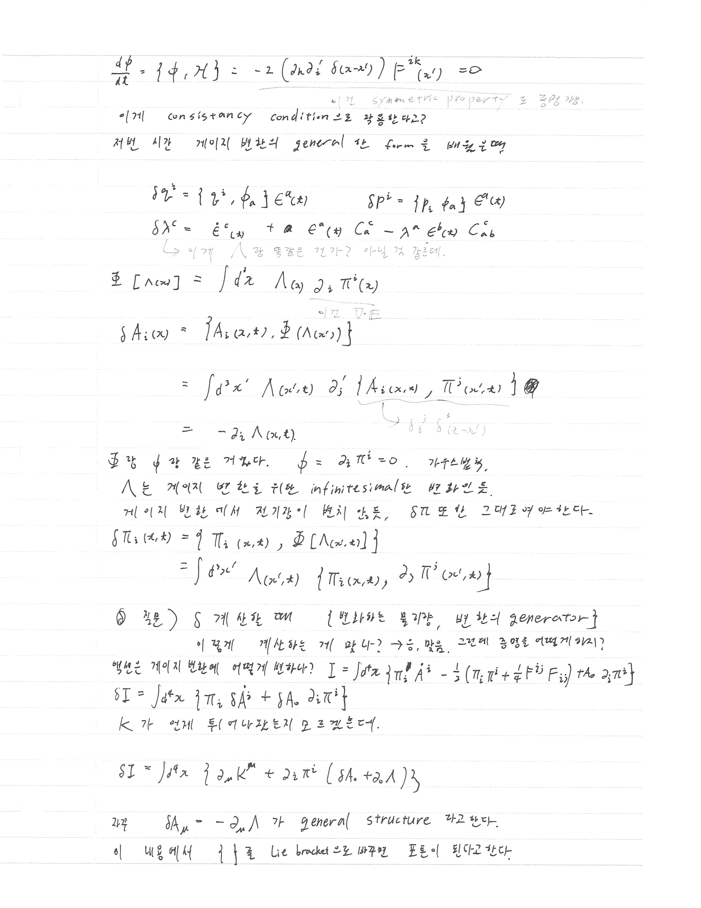
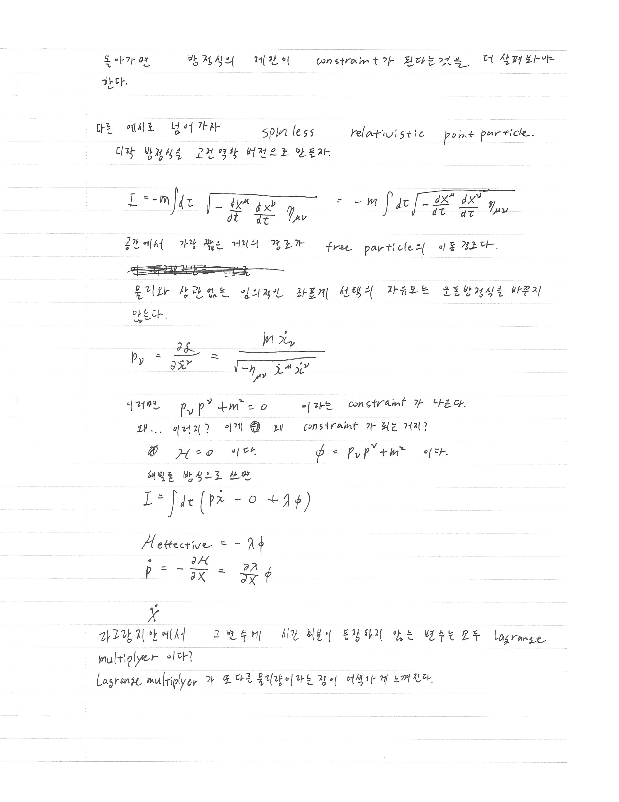

> [!attention] 강의 필기
> 이것은 [[Analytical Mechanics]] 강의를 듣고 적은 필기입니다. 
> 정리가 안 되어 있고, 개인적인 생각과 풀이가 섞여 있을 수도 있습니다. 

# 지난 강의

[[AM lecture note - Poisson bracket and constraints]]

# 오늘의 핵심

- Constraint system은 1st class와 2nd class로 나뉜다 — $\{\phi_a, \phi_b\}$의 invertibility로 결정
- **1st class**: $\{H, \phi\}$의 inverse가 없는 경우 → constraint가 게이지 변환의 generator
- **Free spinless relativistic particle**: 질량 껍질 조건 $p_\mu p^\mu + m^2 = 0$ 이 1st class constraint로 등장
- **전자기장(EM field)**: $A_0$가 Lagrange multiplier 역할, Gauss 법칙 $\phi = \partial_i \pi^i = \nabla \cdot \mathbf{E} = 0$ 이 1st class constraint
- 게이지 변환의 generator $\Phi[\Lambda]$, 그리고 그에 따른 $\delta A_i$, $\delta \pi_i$ 계산

# 필기 내용

## 서론: 1st/2nd class constraint의 구분

오늘은 **1st class constraint system의 예시**를 볼 것이다. 밤에는 **2nd class constraint system의 예시**를 볼 것이다.

Constraint들의 **consistency condition**으로 나뉜다:

- $\{H, \phi\}$의 inverse가 존재하면 → **2nd class**
- inverse가 없으면 → **1st class** : constraint가 게이지 변환의 generator이다

> [!question] 궁금한 내용
> 고전 역학을 양자화한다는 게 경로적분에서 phase가 생기는 것과 연관이 있을까? $[\cdot, \cdot] \to \{\cdot, \cdot\}$ 로 연관지을 수 있을까?

> [!note] Glia의 보충 (2026-03-19)
> 맞아. 방향은 반대지만 연결은 실재한다.
> 
> **정준 양자화**: 고전역학 → 양자역학 방향으로, $\{f, g\} \to \frac{1}{i\hbar}[\hat{f}, \hat{g}]$ 로 대응시킨다. Poisson bracket이 교환자(commutator)가 된다.
> 
> **경로적분**: 고전적으로 허용되는 경로 하나만이 아니라 모든 경로에 $e^{iS/\hbar}$ 위상을 부여해 합산한다. $\hbar \to 0$ 극한에서 $\delta S = 0$인 경로(정류점)만 살아남아 고전역학을 재현한다. 이게 경로적분에서 phase가 생기는 이유다.
> 
> 두 관점은 동치이고, Dirac이 처음 연결했다.

Constraint가 0이므로, 이것(generator)에 대한 최적 charge는 0이어야 한다.

---

## 예시 ①: Free spinless relativistic particle

### 라그랑지안과 액션

공간에서 가장 짧은 거리의 경로가 free particle의 이동 경로다. 상대론에서 이것은 고유시간으로 쓰면:

$$
I(x, \dot{x}) = \int d\tau \left( p_\mu \dot{x}^\mu - \lambda(p^2 + m^2) \right)
$$

여기서 $m$은 질량, $\lambda$는 Lagrange multiplier이다.

$$
p^2 = p_\mu p^{\mu} = p_0^2 - \vec{p}\cdot\vec{p}
$$

> [!question] 궁금한 내용
> $p_\mu$가 뭘까. 공간을 결정하는 metric인가? 일반상대론 개념이라 한다.

> [!note] Glia의 보충 (2026-03-19)
> $p_\mu$는 metric이 아니라 **공변 운동량(covariant momentum)**이다. metric $\eta_{\mu\nu}$는 민코프스키 계량으로 거리를 정의하는 텐서이고, $p_\mu$는 반변 운동량 $p^\mu$와의 관계
> $$
> p_\mu = \eta_{\mu\nu} p^\nu
> $$
> 로 정의된다. $p^\mu = (E/c,\; \vec{p})$ 이면 $p_\mu = (E/c,\; -\vec{p})$ (부호규약에 따라). metric이 음수 부호를 만들어주는 구조다.

시공간은 $t, x, y, z$까지 포함한 위상공간이다.

### 정준 운동량

$$
p_\nu = \frac{\partial \mathcal{L}}{\partial \dot{x}^\nu} = \frac{m\, \dot{x}_\nu}{\sqrt{-\eta_{\mu\nu}\, \dot{x}^\mu \dot{x}^\nu}}
$$

이로부터 자연스럽게:

$$
p_\nu p^\nu + m^2 = 0
$$

이 **constraint가 나온다**.

> [!question] 궁금한 내용
> 왜 constraint가 되는 건지? $\mathcal{H} = 0$이라는 것과 어떻게 연결되는가?

> [!note] Glia의 보충 (2026-03-19)
> **constraint가 되는 이유**: $p_\nu = \frac{m\dot{x}_\nu}{\sqrt{-\eta_{\mu\nu}\dot{x}^\mu\dot{x}^\nu}}$ 를 제곱하면 $p_\nu p^\nu = -m^2$ 이 항등적으로 나온다. 운동방정식에서 유도된 게 아니라 **운동량의 정의 자체에서 항등적으로 나오는 조건** → constraint.
> 
> **$\mathcal{H} = 0$과의 연결**: 상대론적 입자에서 $\mathcal{H} = p_\mu \dot{x}^\mu - \mathcal{L}$을 계산하면 $\mathcal{H} = 0$이 나오는데, 이것은 **reparametrization invariance**(고유시간 $\tau$를 자유롭게 재정의할 수 있는 대칭)의 결과다. $\mathcal{H} = 0$이 바로 constraint $\phi = p^2 + m^2 = 0$과 같은 것이고, $\lambda$는 이 constraint를 action에 집어넣는 Lagrange multiplier다.

### Hamiltonian formalism

Hamiltonian을 해밀톤 방정식으로 쓰면:

$$
I = \int d\tau \left( p\dot{x} - 0 + \lambda\phi \right)
$$

$$
H_{\text{effective}} = -\lambda\phi
$$

$$
\dot{p} = -\frac{\partial \mathcal{H}}{\partial x} = \frac{\partial \lambda}{\partial x}\phi
$$

> [!question] 궁금한 내용
> 라그랑지안 안에서 시간 미분이 등장하지 않는 변수는 모두 Lagrange multiplier인가? Lagrange multiplier가 또 다른 물리량이라는 점이 어색하게 느껴진다.

> [!note] Glia의 보충 (2026-03-19)
> **맞아, 1차 formalism에서는 그렇게 봐도 된다.** action $I = \int dt\,(p\dot{q} - H + \lambda\phi)$ 에서 $\lambda$는 $\dot{\lambda}$가 없으니 $\lambda$로 변분하면 $\phi = 0$이라는 constraint만 나오고 $\lambda$ 자체의 운동방정식은 없다. 즉 $\lambda$는 **임의 함수(arbitrary function)**로 남아 게이지 자유도가 된다.
> 
> 어색하게 느껴지는 건 당연한데, Lagrange multiplier는 "물리량"이라기보다 **constraint를 action에 집어넣는 수학적 도구**이고, 그 값이 고정되지 않는다는 게 바로 게이지 불변성의 표현이다.

---

## 예시 ②: Electromagnetic field (1st class constraint system)

### 액션

$$
I[A_i, A_0, E_i] = \int d^4x \left\{ E_i \dot{A}^i - \left(\frac{1}{2}E_i^2 + \frac{1}{4}F_{ij}^2\right) + A_0\,\partial_i E \right\}
$$

$A_0$는 라그랑주 승수, $F$는 자기장.

가우스 법칙은 gauge transform의 generator이다.

$$
i \in \{1, 2, 3\}, \quad \text{공간은 3차원, 시공간은 4차원}
$$

$$
F_{\mu\nu} = \partial_\mu A_\nu - \partial_\nu A_\mu
$$

### 전자기 텐서 액션의 전개

$$
I_{\text{EM}} = -\frac{1}{4}\int d^4x\, F^{\mu\nu}F_{\mu\nu}
$$

$\mu\nu$ 합에서 부호가 다른 방향이 다른 등.

$$
= \int d^4x \left( -\frac{1}{2}F^{0i}F_{0i} - \frac{1}{4}F^{ij}F_{ij} \right)
$$

$$
= \int d^4x \left\{ \frac{1}{2}(\dot{A}_i - \partial_i A_0)(\dot{A}^i - \partial^i A_0) - \frac{1}{4}F_{ij}F^{ij} \right\}
$$

더 전개하면:

$$
I_{\text{EM}} = \int d^4x \left\{ \frac{1}{2}\dot{A}_i\dot{A}^i - \dot{A}_i\partial^i A_0 + \frac{1}{2}\partial_i A_0\,\partial^i A^0 - \frac{1}{4}F^{ij}F_{ij} \right\}
$$

맥스웰 방정식: $\partial_\mu \frac{\partial \mathcal{L}}{\partial(\partial_\mu A^\nu)} - \frac{\partial \mathcal{L}}{\partial A^\nu} = 0$ → 라그랑주-오일러 방정식.

### 정준 운동량 $\pi_i$

$$
\pi_i = \frac{\partial \mathcal{L}}{\partial \dot{A}^i} = \dot{A}_i - \partial_i A_0 \quad \Rightarrow \quad \dot{A}_i = \pi_i + \partial_i A_0
$$

이것을 해밀토니안으로 전환하면 $\mathcal{H} = \pi_i \dot{A}^i - \mathcal{L}$ 이 나온다:

$$
\mathcal{H} = \frac{1}{2}(|\mathbf{E}\cdot\mathbf{E}| + |\mathbf{B}\cdot\mathbf{B}|) - A_0\,\partial_i E
$$

이것이 **modified Hamiltonian** (constraint 포함).

### 해밀톤 형식 액션

$$
I_{\text{EM}}[A_i, \pi_i, A_0] = \int d^4x \left\{ \pi_i\dot{A}^i - \left(\frac{1}{2}\pi_i\pi^i + \frac{1}{4}F^{ij}F_{ij}\right) + A_0\,\partial_i\pi^i \right\}
$$

### Constraint: 가우스 법칙

$$
\phi = \partial_i\pi^i = \nabla\cdot\mathbf{E}
$$

> [!question] 궁금한 내용
> 이건 가우스 법칙? $\pi$가 $E$인가? $A$에 상응하는 운동량이 전기장이라고?

> [!note] Glia의 보충 (2026-03-19)
> **맞아.** 정의를 따라가면:
> $$
> \pi_i = \frac{\partial \mathcal{L}}{\partial \dot{A}^i} = \dot{A}_i - \partial_i A_0 = E_i
> $$
> 전기장의 정의 자체가 $\mathbf{E} = -\dot{\mathbf{A}} - \nabla A_0$ 이니까 $\pi_i$는 정확히 전기장의 각 성분이다. **EM field에서 canonical momentum이 전기장**이라는 아름다운 사실로, "위치"가 $A_i$, "운동량"이 $E_i$인 셈이다.

운동방정식:

$$
\dot{\pi}_i = -\frac{\partial H}{\partial A^i}, \qquad \dot{A}_i = \frac{\partial H}{\partial \pi_i}, \qquad \phi = 0
$$

Consistency condition:

$$
\dot{\phi} = \{\phi, \mathcal{H}\} = 0
$$

자세히 계산하면:

$$
\{\phi(x),\, \mathcal{H}(x')\} = \left\{ \partial_i\pi^i(x),\; \frac{1}{2}(\pi_i(x')\pi^i(x') + F_{ij}(x')F^{ij}(x')) - \frac{1}{2}A_0(x')\,\partial_i\pi^i(x') \right\}
$$

Poisson bracket의 기본 관계:

$$
\{\pi_i(x),\, \pi_j(x')\} = 0, \qquad \{A_i(x),\, A_j(x')\} = 0, \qquad \{A_i(x),\, \pi_j(x')\} = \delta_{ij}\,\delta^3(x-x')
$$

> [!question] 궁금한 내용
> 왜 푸아송 괄호 계산하는 데에, 다른 위치에서 두 물리량을 고려하는 것일까?

> [!note] Glia의 보충 (2026-03-19)
> 이게 **장론(field theory)에서의 Poisson bracket** 특성이다.
> 
> 입자역학에서는 자유도가 유한하니 $\{q_i, p_j\} = \delta_{ij}$만 있으면 충분하다. 그런데 장론에서는 **각 공간점 $x$마다 자유도가 하나**씩 있다 — $A_i(x)$와 $\pi_j(x')$는 서로 다른 자유도다. 그래서:
> $$
> \{A_i(x), \pi_j(x')\} = \delta_{ij}\,\delta^3(x - x')
> $$
> $x = x'$일 때만 비자명한 bracket을 갖고 (dirac delta), $x \neq x'$이면 독립적인 자유도이라 0이 된다. 이게 장론에서의 **국소성(locality)**을 반영하는 거다.

$$
\frac{d\phi}{dt} = \{\phi, \mathcal{H}\} = -2\left(\partial_k\partial_i\,\delta(x-x')\right)F^{ik}(x') = 0
$$

symmetric property를 이용해서 0이 됨.

이게 consistency condition으로 작동한다!

### 게이지 변환

지난 시간, 게이지 변환의 general한 form:

$$
\delta q^i = \{q^i, \phi_a\}\,\epsilon^a(t), \qquad \delta p^i = \{p_i, \phi_a\}\,\epsilon^a(t)
$$

$$
\delta\lambda^c = \dot{\epsilon}^c_{(t)} + \theta\,\epsilon^a(t)\,C_a^c - \lambda^a\,\epsilon^b(t)\,C_{ab}^c
$$

> [!question] 궁금한 내용
> 이것의 $\lambda$ 랑 아래 식의 $\Lambda$랑 같은 건가?

> [!note] Glia의 보충 (2026-03-19)
> **달라.** 역할이 유사하지만 다른 개체다.
> - $\lambda$ (소문자): Dirac formalism에서 constraint $\phi_a$에 곱해지는 Lagrange multiplier. 임의의 constraint system에나 등장하는 일반적인 기호.
> - $\Lambda$ (대문자): **EM field의 게이지 변환 파라미터**. $\delta A_\mu = -\partial_\mu\Lambda$ 를 생성하는 임의 함수.
> 
> EM field에서는 $A_0$가 $\lambda$의 역할을 하고, $\Lambda$는 게이지 변환을 parametrize하는 별개의 함수다. 두 개가 구조적으로 대응하는 건 $\delta A_0 = -\dot{\Lambda}$가 $\delta\lambda^c = \dot{\epsilon}^c + \ldots$와 같은 패턴을 함이다.

Generator:

$$
\Phi[\Lambda(x)] = \int d^3z\; \Lambda(z)\,\partial_i\pi^i(z)
$$

이것이 $\nabla\cdot\mathbf{E}$ 이다.

$$
\delta A_i(x) = \{A_i(x,t),\, \Phi[\Lambda(x')]\}
$$

$$
= \int d^3x'\,\Lambda(x', t)\,\partial_j^{}\{A_i(x,t),\, \pi^j(x', t)\}
$$

$$
= -\partial_i\Lambda(x, t)
$$

$\Phi$와 $\phi$는 같은 것이다. $\phi = \partial_i\pi^i = 0$ — 가우스 법칙.

$\Lambda$는 게이지 변환을 취하는(infinitesimal한 변환의 양).  
게이지 변환에서 전기장이 변하지 않듯, $\delta\pi$도 그대로여야 한다:

$$
\delta\pi_i(x, t) = \{\pi_i(x, t),\, \Phi[\Lambda(x, t)]\}
$$

$$
= \int d^3x'\,\Lambda(x', t)\left\{\pi_i(x, t),\, \partial_j\pi^j(x', t)\right\}
$$

### 맥스웰 방정식과 constraint

$$
\delta I = \int d^4x \left\{ \pi_i\,\delta A^i + \delta A_0\,\partial_i\pi^i \right\}
$$

$K$가 언제 투명하게 되는지 모르겠다.

$$
\delta I = \int d^4x \left\{ \partial_\mu K^{\mu} + \partial_i\pi^i(\delta A_0 + \partial_0\Lambda) \right\}
$$

따라서 $\delta A_\mu = -\partial_\mu\Lambda$가 **general structure**라고 한다.

이 내용에서 $\{\cdot\}$를 Lie bracket으로 바꾸면 표준이 된다고 한다.

돌아가면 방정식의 제한이 constraint가 된다는 것을 더 살펴봐야 한다.

맥스웰 방정식이 각각 전기장과 자기장이 가질 수 있는 상태를 제한한다.  
이게 constraint로 라그랑주 역할에 반영되는 것이다.

---

## 예시 ③: Spinless relativistic point particle (Hamiltonian)

다각 방정식을 고전 역학 버전으로 만들자.

$$
I = -m\int d\tau\,\sqrt{-\frac{dx^\mu}{d\tau}\frac{dx^\nu}{d\tau}\eta_{\mu\nu}} = -m\int d\tau\,\sqrt{-\frac{dx^\mu}{d\tau}\frac{dx^\nu}{d\tau}\eta_{\mu\nu}}
$$

공간에서 가장 짧은 거리의 경로가 free particle의 이동 경로다.

물리와 상관없는 임의적인 좌표계 선택의 자유도는 운동방정식을 바꾸지 않는다.

$$
p_\nu = \frac{\partial \mathcal{L}}{\partial \dot{x}^\nu} = \frac{m\,\dot{x}_\nu}{\sqrt{-\eta_{\mu\nu}\,\dot{x}^\mu\dot{x}^\nu}}
$$

이로부터 $p_\nu p^\nu + m^2 = 0$ 이라는 constraint가 나온다.

그러면... 이게 왜 constraint가 되는 거지? $\mathcal{H} = 0$이다. $\phi = p_\nu p^\nu + m^2$ 이다.

해밀톤 방정식으로 쓰면:

$$
I = \int d\tau\left(p\dot{x} - 0 + \lambda\phi\right)
$$

$$
H_{\text{effective}} = -\lambda\phi
$$

$$
\dot{p} = -\frac{\partial \mathcal{H}}{\partial x} = \frac{\partial\lambda}{\partial x}\phi
$$

라그랑지안 안에서 그 변수에 시간 미분이 등장하지 않는 변수는 모두 Lagrange multiplier이다.

# 궁금한 내용

# AI의 보충 설명

> [!note] Glia의 보충 (2026-03-19): 대칭성, 임의성, 그리고 보존량
> 
> 강의 중 교수님이 강조한 핵심 통찰:
> 
> **"인간이 임의적으로 결정하는 양은 수식을 풀기 위해 박아 정한 값이기 때문에, 운동방정식을 바꾸지 않는다. 이것이 대칭성이고, 대칭성은 보존량을 만든다."**
> 
> 구체적인 예:
> 
> | 임의로 결정하는 양 | 대칭성 | 보존량 |
> |---|---|---|
> | 공간 원점의 위치 | 공간 병진 대칭 | 운동량 |
> | 시간의 기준점 | 시간 병진 대칭 | 에너지 |
> | 공간의 방향 | 회전 대칭 | 각운동량 |
> | 게이지 함수 $\Lambda(x,t)$ | 게이지 대칭 | 전하 |
> 
> 이것이 Noether 정리의 본질이다. [[AM lecture note - Noether theorem]] 참고.
> 
> **갈릴레이 변환 vs 게이지 변환의 차이**:
> - 갈릴레이/로렌츠 변환 → **global 대칭** ($\Lambda$ = 상수, 시공간 전체에서 같은 변환)
> - 게이지 변환 → **local 대칭** ($\Lambda(x,t)$, 위치·시간마다 다른 변환 허용)
> 
> Local 대칭이 있으면 반드시 위상공간에 잉여 자유도(redundancy)가 생기고, 이것이 **1st class constraint**로 나타난다. 즉:
> 
> $$
> \text{local 대칭} \iff \text{1st class constraint} \iff \text{게이지 자유도}
> $$
> 
> 세 가지는 같은 말이다.

# 연관 학습 노트

# References

David Tong, Classical Dynamics lecture notes

# 다음 강의

[[AM lecture note - Relativistic particle and Dirac bracket]]

# 필기 원본
[[AM_4thweek_2.pdf]]

---

## 필기 스캔본 이미지

