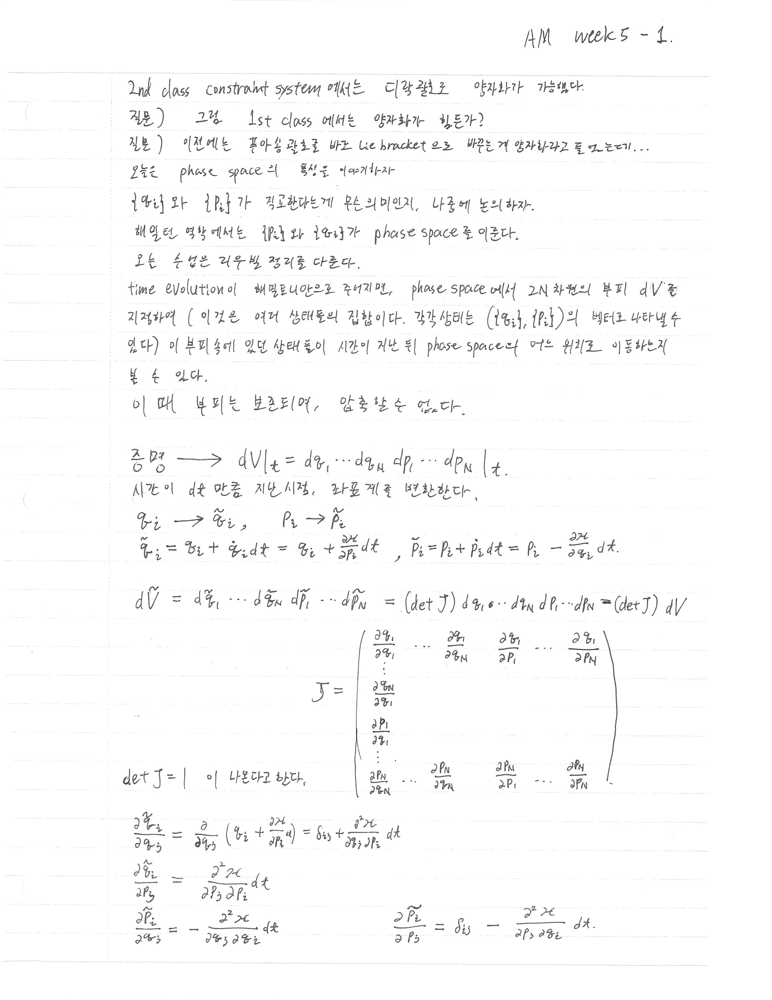
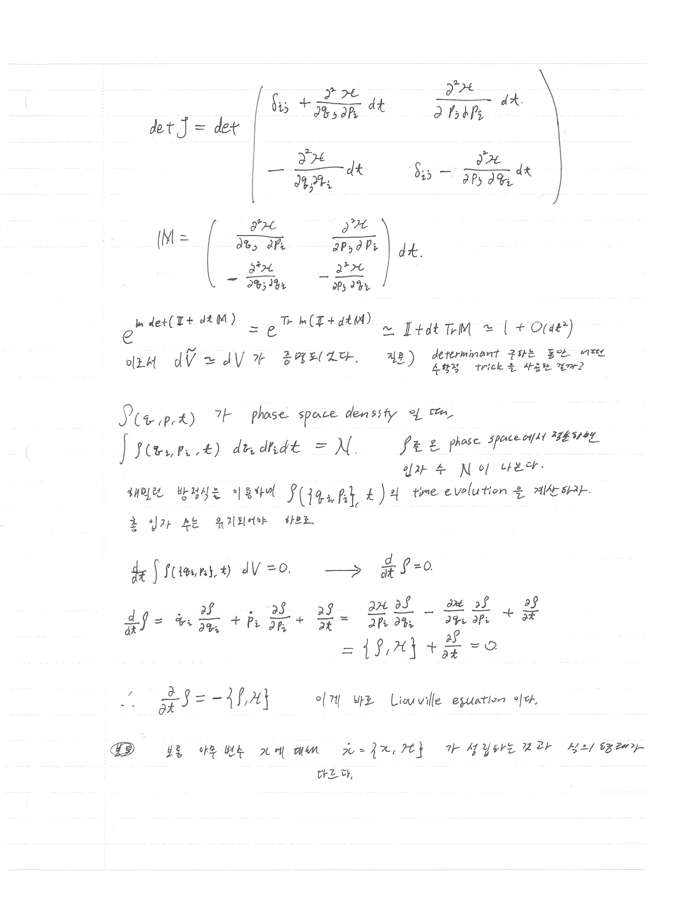
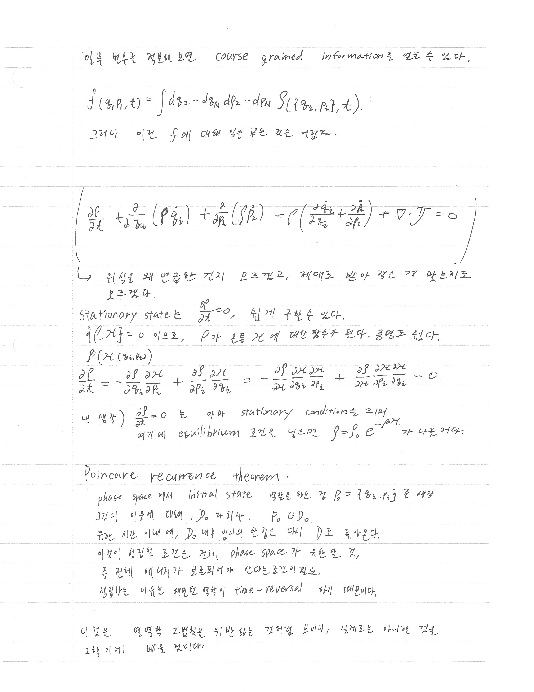
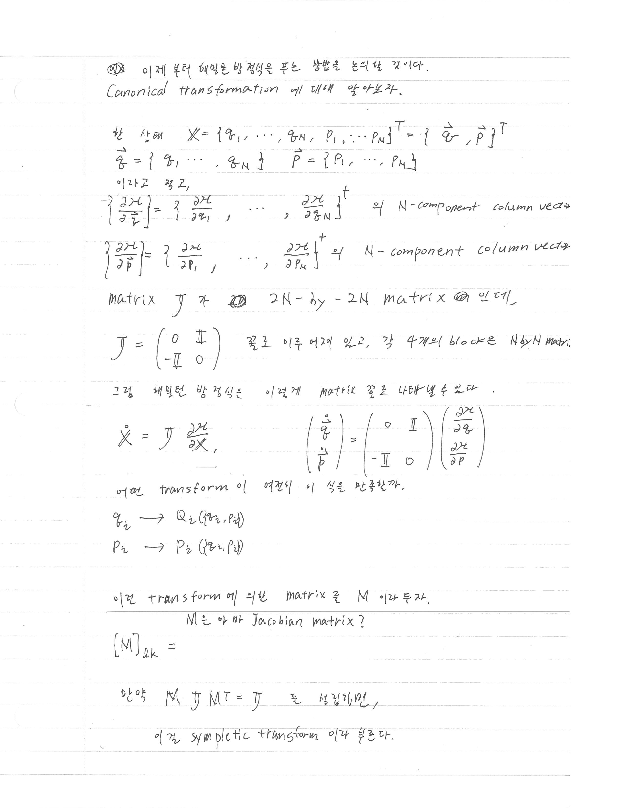

> [!attention] 강의 필기
> 이것은 [[Analytical Mechanics]] 강의를 듣고 적은 필기입니다. 
> 정리가 안 되어 있고, 개인적인 생각과 풀이가 섞여 있을 수도 있습니다. 

# 지난 강의

[[AM lecture note - Poisson bracket and constraints]]

# 오늘의 핵심

- Phase space에서 시간 발전은 부피 $dV$를 보존한다 → **Liouville 정리**
- Liouville 방정식: $\frac{\partial \rho}{\partial t} = -\{\rho, \mathcal{H}\}$
- Stationary state: $\rho = \rho(\mathcal{H})$이면 자동으로 $\frac{\partial \rho}{\partial t} = 0$
- Poincaré recurrence theorem: 유한한 phase space를 가진 계에서 임의의 상태는 유한 시간 내에 초기 상태 근방으로 돌아온다.
- **Canonical transformation** 도입: 새 좌표 $(Q_i, P_i)$로 변환하되 Hamilton 방정식의 형태를 보존하는 변환. Jacobian $M$이 $M\mathbb{J}M^T = \mathbb{J}$를 만족하면 **symplectic transform**이라 한다.

# 필기 내용

## 도입: 양자화와 phase space

오늘 강의 처음에 나온 질문들:
- 2nd class constraint system에서는 디랙 괄호로 양자화가 가능하다.
- 질문: 그럼 1st class에서는 양자화가 힘든가?
- 질문: 이전에는 푸아송 괄호를 바로 Lie bracket으로 바꾸는 게 양자화라고 들었는데... 아하 constraint가 없어서 푸아송 괄호랑 디락 괄호가 같나보구나. 

오늘은 **phase space의 특성을 이해**하는 것이 목표다. $\{q_i\}$와 $\{p_i\}$가 직교한다는 게 무슨 의미인지, 나중에 논의하자. 해밀턴 역학에서는 $\{q_i\}$와 $\{p_i\}$가 phase space를 이룬다.

---

## Liouville 정리 유도

### Phase space 부피의 시간 발전

오늘 수업은 **Liouville 정리**를 다룬다.

Time evolution이 해밀토니안으로 주어지면, phase space에서 $2N$차원의 부피 $dV$를 지정하여 (이것은 여러 상태들의 집합이다. 각 상태는 $(q_i, p_i)$의 벡터로 나타낼 수 있다) 이 부피 속에 있던 상태들이 시간이 지난 뒤 phase space의 어느 위치로 이동하는지 볼 수 있다.

**이 때 부피는 보존되어, 압축할 수 없다.**

증명해보자. 

$$
dV\big|_t = dq_1 \cdots dq_N\, dp_1 \cdots dp_N \big|_t
$$

시간이 $dt$ 만큼 지난 시점에서 좌표계를 변환한다:

$$
q_i \to \tilde{q}_i = q_i + \dot{q}_i\, dt = q_i + \frac{\partial \mathcal{H}}{\partial p_i}dt
$$

$$
p_i \to \tilde{p}_i = p_i + \dot{p}_i\, dt = p_i - \frac{\partial \mathcal{H}}{\partial q_i}dt
$$

변환된 부피는 Jacobian $J$로 계산된다:

$$
d\tilde{V} = d\tilde{q}_1 \cdots d\tilde{q}_N\, d\tilde{p}_1 \cdots d\tilde{p}_N = (\det J)\, dq_1 \cdots dq_N\, dp_1 \cdots dp_N = (\det J)\, dV
$$

> [!note] Glia의 보충 (2026-03-24) — 왜 부피 원소 변환에 $\det J$가 등장하는가?
>
> 엄밀하게는 $dq_1 \cdots dp_N$을 **외적(exterior product, wedge product)** 으로 써야 한다:
>
> $$
> dV = dq_1 \wedge \cdots \wedge dq_N \wedge dp_1 \wedge \cdots \wedge dp_N
> $$
>
> Wedge product의 핵심 성질은 **반대칭성**이다:
>
> $$
> dx^i \wedge dx^i = 0, \qquad dx^i \wedge dx^j = -dx^j \wedge dx^i
> $$
>
> 2차원 예시로 $(x, y) \to (\tilde{x}, \tilde{y})$ 변환을 생각하면, 연쇄법칙으로:
>
> $$
> d\tilde{x} = \frac{\partial \tilde{x}}{\partial x}dx + \frac{\partial \tilde{x}}{\partial y}dy, \qquad d\tilde{y} = \frac{\partial \tilde{y}}{\partial x}dx + \frac{\partial \tilde{y}}{\partial y}dy
> $$
>
> 면적 원소를 wedge product로 계산하면:
>
> $$
> d\tilde{x} \wedge d\tilde{y} = \left(\frac{\partial \tilde{x}}{\partial x}dx + \frac{\partial \tilde{x}}{\partial y}dy\right) \wedge \left(\frac{\partial \tilde{y}}{\partial x}dx + \frac{\partial \tilde{y}}{\partial y}dy\right)
> $$
>
> 반대칭성 $dx \wedge dx = 0$, $dy \wedge dx = -dx \wedge dy$을 적용하면:
>
> $$
> = \frac{\partial \tilde{x}}{\partial x}\frac{\partial \tilde{y}}{\partial y}\,(dx \wedge dy) + \frac{\partial \tilde{x}}{\partial y}\frac{\partial \tilde{y}}{\partial x}\,(dy \wedge dx)
> $$
>
> $$
> = \left(\frac{\partial \tilde{x}}{\partial x}\frac{\partial \tilde{y}}{\partial y} - \frac{\partial \tilde{x}}{\partial y}\frac{\partial \tilde{y}}{\partial x}\right)(dx \wedge dy) = \det J \cdot (dx \wedge dy)
> $$
>
> 괄호 안이 정확히 $2\times 2$ Jacobian의 행렬식이다. 이것이 우연이 아니라, **$\det J$의 정의 자체가 이 반대칭 구조에서 나오는 것**이다. $2N$차원으로 일반화하면 동일한 논리로:
>
> $$
> d\tilde{q}_1 \wedge \cdots \wedge d\tilde{q}_N \wedge d\tilde{p}_1 \wedge \cdots \wedge d\tilde{p}_N = \det J \cdot (dq_1 \wedge \cdots \wedge dq_N \wedge dp_1 \wedge \cdots \wedge dp_N)
> $$
>
> 따라서 필기의 $d\tilde{V} = (\det J)\,dV$는 이 wedge product 관계의 축약 표현이다.

Jacobian 행렬은 다음과 같다:

$$
J = \begin{pmatrix}
\dfrac{\partial \tilde{q}_1}{\partial q_1} & \cdots & \dfrac{\partial \tilde{q}_1}{\partial q_N} & \dfrac{\partial \tilde{q}_1}{\partial p_1} & \cdots & \dfrac{\partial \tilde{q}_1}{\partial p_N} \\[6pt]
\vdots & & & & & \vdots \\[2pt]
\dfrac{\partial \tilde{q}_N}{\partial q_1} & & & & & \\[6pt]
\dfrac{\partial \tilde{p}_1}{\partial q_1} & & & & & \\[6pt]
\vdots & & & & & \vdots \\[2pt]
\dfrac{\partial \tilde{p}_N}{\partial q_1} & \cdots & \dfrac{\partial \tilde{p}_N}{\partial q_N} & \dfrac{\partial \tilde{p}_N}{\partial p_1} & \cdots & \dfrac{\partial \tilde{p}_N}{\partial p_N}
\end{pmatrix}
$$

각 성분을 계산하면:

$$
\frac{\partial \tilde{q}_i}{\partial q_j} = \delta_{ij} + \frac{\partial^2 \mathcal{H}}{\partial q_j \partial p_i}dt, \qquad
\frac{\partial \tilde{q}_i}{\partial p_j} = \frac{\partial^2 \mathcal{H}}{\partial p_j \partial p_i}dt
$$

$$
\frac{\partial \tilde{p}_i}{\partial q_j} = -\frac{\partial^2 \mathcal{H}}{\partial q_j \partial q_i}dt, \qquad
\frac{\partial \tilde{p}_i}{\partial p_j} = \delta_{ij} - \frac{\partial^2 \mathcal{H}}{\partial p_j \partial q_i}dt
$$

이를 블록 행렬 형태로 쓰면:

$$
J = \mathbb{I} + dt\cdot M
$$

여기서 $M$은:

$$
M = \begin{pmatrix}
\dfrac{\partial^2 \mathcal{H}}{\partial q_j \partial p_i} & \dfrac{\partial^2 \mathcal{H}}{\partial p_j \partial p_i} \\[10pt]
-\dfrac{\partial^2 \mathcal{H}}{\partial q_j \partial q_i} & -\dfrac{\partial^2 \mathcal{H}}{\partial p_j \partial q_i}
\end{pmatrix} dt
$$

이로부터 $\det J$를 계산한다:

$$
e^{\ln\det(\mathbb{I} + dt\cdot M)} = e^{\text{Tr}\ln(\mathbb{I} + dt\cdot M)} \approx \mathbb{I} + dt\cdot \text{Tr}\, M \approx 1 + O(dt^2)
$$

$\text{Tr}\, M$을 계산하면:

$$
\text{Tr}\, M = \frac{\partial^2 \mathcal{H}}{\partial q_i \partial p_i} - \frac{\partial^2 \mathcal{H}}{\partial p_i \partial q_i} = 0
$$

편미분의 교환 가능성 ($\mathcal{H}$가 매끄러운 함수이므로)에 의해 두 항이 정확히 상쇄된다.

따라서 $\det J = 1$이므로 $d\tilde{V} = dV$. **Phase space 부피가 보존된다.** ✓

> [!question] 질문 (필기 중 발생)
> determinant 구하는 동안 어떤 수학적 trick을 사용한 건가?

---

## Liouville 방정식

$\rho(q_i, p_i, t)$가 phase space density라 하면, 전체 적분이 입자 수 $N$으로 보존된다:

$$
\int \rho(q_i, p_i, t)\, dq_i\, dp_i\, dt = N
$$

$\rho$는 phase space에서 정규화된 입자 수 밀도이다.

해밀턴 방정식을 이용하여 $\rho(\{q_i\}, \{p_i\}, t)$의 time evolution을 계산하자. 총 입자 수는 유지되어야 하므로:

$$
\frac{d}{dt}\int \rho(\{q_i\}, \{p_i\}, t)\, dV = 0 \quad \Longrightarrow \quad \frac{d}{dt}\rho = 0
$$

$\rho$의 전미분을 전개하면:

$$
\frac{d}{dt}\rho = \dot{q}_i \frac{\partial \rho}{\partial q_i} + \dot{p}_i \frac{\partial \rho}{\partial p_i} + \frac{\partial \rho}{\partial t}
$$

$$
= \frac{\partial \mathcal{H}}{\partial p_i}\frac{\partial \rho}{\partial q_i} - \frac{\partial \mathcal{H}}{\partial q_i}\frac{\partial \rho}{\partial p_i} + \frac{\partial \rho}{\partial t}
$$

$$
= \{\rho, \mathcal{H}\} + \frac{\partial \rho}{\partial t} = 0
$$

따라서:

$$
\boxed{\frac{\partial \rho}{\partial t} = -\{\rho, \mathcal{H}\}}
$$

이것이 바로 **Liouville 방정식**이다.

> [!note] Glia의 보충 (2026-03-24)
> $\frac{d}{dt}\rho = 0$은 **전미분(total derivative)**이 0이라는 뜻이다. 즉, phase space에서 흐르는 유체의 관점에서 특정 '유체 원소'를 따라가면 밀도가 변하지 않는다. 이것이 비압축성(incompressibility)과 같은 의미다.
>
> 반면 $\frac{\partial \rho}{\partial t}$는 **편미분(partial derivative)**으로, 고정된 phase space 좌표 $(q_i, p_i)$에서의 밀도 변화율이다. 이 둘의 차이가 바로 Liouville 방정식이 표현하는 내용이다.

---

## Stationary state와 평형 조건

Stationary state는 $\frac{\partial \rho}{\partial t} = 0$으로, 쉽게 구할 수 있다.

$\{\rho, \mathcal{H}\} = 0$이 되려면, $\rho$가 온전히 $\mathcal{H}$에 대한 함수가 되면 된다. 즉:

$$
\rho = \rho(\mathcal{H}(q_i, p_i))
$$

이면 자동으로 $\frac{\partial \rho}{\partial t} = 0$이다. 이를 확인하면:

$$
\frac{\partial \rho}{\partial t} = -\frac{\partial \rho}{\partial q_i}\frac{\partial \mathcal{H}}{\partial p_i} + \frac{\partial \rho}{\partial p_i}\frac{\partial \mathcal{H}}{\partial q_i}
= -\frac{\partial \rho}{\partial \mathcal{H}}\frac{\partial \mathcal{H}}{\partial q_i}\frac{\partial \mathcal{H}}{\partial p_i} + \frac{\partial \rho}{\partial \mathcal{H}}\frac{\partial \mathcal{H}}{\partial p_i}\frac{\partial \mathcal{H}}{\partial q_i} = 0
$$

> [!note] 내 생각
> $\frac{\partial \rho}{\partial t} = 0$은 아마 stationary condition이며, 여기에 equilibrium 조건을 넣으면 $\rho = \rho_0\, e^{-\beta \mathcal{H}}$가 나올 것 같다. 

일부 변수를 적분해 내면 **coarse grained information**을 얻을 수 있다:

$$
f(q_1, p_1, t) = \int dq_2\cdots dq_N\, dp_2 \cdots dp_N\, \rho(\{q_i\}, \{p_i\}, t)
$$

그러나 이것으로 $f$에 대해 닫힌 방정식을 풀기는 어렵다. (BBGKY 계층 구조와 관련됨)

---

## Poincaré recurrence theorem

Phase space에서 initial state 영역을 하는 것 $D_0 = \{q_i, p_i\}$로 생각하자. 그것의 이웃에 대해, $D_0$가 차지한다. $P_0 \in D_0$.

유한 시간 $t$에, $D_0$ 내부 임의의 한 점은 다시 $D$로 돌아온다.

이것이 성립할 조건은 전체 phase space가 **유한한** 것, 즉 전체 에너지가 보존되어야 한다는 조건이 필요하다.

성립하는 이유는 해밀턴 역학이 **time-reversal** 하기 때문이다.

> [!warning] 주의
> 이것은 열역학 2법칙을 위반하는 것처럼 보이나, 실제로는 아니다. Poincaré recurrence time은 우주의 나이보다 훨씬 길기 때문이다.

---

## Canonical transformation 도입

이 내용은 다음 강의 필기에 더 잘 설명되어 있다. 

이제부터 해밀턴 방정식을 푸는 방법을 논의할 것이다. **Canonical transformation**에 대해 알아보자.

### 행렬 표기법

한 상태를 벡터로 표시하자:

$$
\mathbb{X} = \{q_1, \cdots, q_N, p_1, \cdots, p_N\}^T = \begin{pmatrix} \vec{q} \\ \vec{p} \end{pmatrix}^T
$$

여기서 $\vec{q} = \{q_1, \cdots, q_N\}$, $\vec{p} = \{p_1, \cdots, p_N\}$.

이자로 쓰면:

$$
\left\{\frac{\partial \mathcal{H}}{\partial \vec{q}}\right\} = \left\{\frac{\partial \mathcal{H}}{\partial q_1}, \cdots, \frac{\partial \mathcal{H}}{\partial q_N}\right\}^T \quad \text{(N-component column vector)}
$$

$$
\left\{\frac{\partial \mathcal{H}}{\partial \vec{p}}\right\} = \left\{\frac{\partial \mathcal{H}}{\partial p_1}, \cdots, \frac{\partial \mathcal{H}}{\partial p_N}\right\}^T \quad \text{(N-component column vector)}
$$

Matrix $\mathbb{J}$는 $2N \times 2N$ matrix로 정의된다:

$$
\mathbb{J} = \begin{pmatrix} 0 & \mathbb{I} \\ -\mathbb{I} & 0 \end{pmatrix}
$$

각 4개의 블록은 $N \times N$ matrix이다. 이를 이용하면 해밀턴 방정식을 행렬 꼴로 나타낼 수 있다:

$$
\dot{\mathbb{X}} = \mathbb{J}\frac{\partial \mathcal{H}}{\partial \mathbb{X}}, \qquad
\begin{pmatrix} \dot{\vec{q}} \\ \dot{\vec{p}} \end{pmatrix} = \begin{pmatrix} 0 & \mathbb{I} \\ -\mathbb{I} & 0 \end{pmatrix} \begin{pmatrix} \dfrac{\partial \mathcal{H}}{\partial \vec{q}} \\[8pt] \dfrac{\partial \mathcal{H}}{\partial \vec{p}} \end{pmatrix}
$$

### Canonical transformation의 정의

어떤 transform이 여전히 이 식을 만족하는가?

$$
q_i \to Q_i(q_i, p_i)
$$

$$
p_i \to P_i(q_i, p_i)
$$

이 transform에 의한 Jacobian 행렬을 $M$이라 두자:

$$
[M]_{lk} = \frac{\partial (\text{new coord})_l}{\partial (\text{old coord})_k}
$$

만약 $M$이 다음을 만족하면:

$$
M\,\mathbb{J}\,M^T = \mathbb{J}
$$

이것을 **symplectic transform**이라 한다. 그리고 이 변환이 Hamilton 방정식의 형태를 보존하는 **canonical transformation**이 된다.

# 궁금한 내용

- det $J$ 계산에서 $e^{\text{Tr}\ln(\mathbb{I} + dt M)} \approx \mathbb{I} + dt\cdot\text{Tr}M$ 전개에 사용된 수학적 트릭은 무엇인가? ($\ln\det A = \text{Tr}\ln A$ 공식?)
- Canonical transformation이 정확히 어떻게 Hamilton 방정식을 보존하는지 (symplectic 조건의 유도)
- 1st class constraint system에서 양자화가 어려운 이유는?

# AI의 보충 설명

> [!note] Glia의 보충 (2026-03-24) — $\ln\det A = \text{Tr}\ln A$ 트릭
>
> 필기에서 사용된 수학 트릭을 설명한다.
>
> **핵심 공식:** 임의의 가역 행렬 $A$에 대해
>
> $$
> \ln \det A = \text{Tr}\ln A
> $$
>
> 이 성립한다. 이를 $A = \mathbb{I} + dt\cdot M$에 적용하면:
>
> $$
> \det(\mathbb{I} + dt\cdot M) = e^{\text{Tr}\ln(\mathbb{I} + dt\cdot M)}
> $$
>
> 이제 $dt \to 0$ 극한에서 로그를 급수 전개한다:
>
> $$
> \ln(\mathbb{I} + dt\cdot M) = dt\cdot M - \frac{(dt)^2}{2}M^2 + \cdots
> $$
>
> Trace를 취하면:
>
> $$
> \text{Tr}\ln(\mathbb{I} + dt\cdot M) = dt\cdot \text{Tr}(M) + O(dt^2)
> $$
>
> 따라서:
>
> $$
> \det(\mathbb{I} + dt\cdot M) = e^{dt\cdot\text{Tr}(M) + O(dt^2)} \approx 1 + dt\cdot\text{Tr}(M) + O(dt^2)
> $$
>
> 그런데 $\text{Tr}(M) = \frac{\partial^2\mathcal{H}}{\partial q_i\partial p_i} - \frac{\partial^2\mathcal{H}}{\partial p_i\partial q_i} = 0$이므로
>
> $$
> \det J = 1 + O(dt^2) \to 1
> $$
>
> **왜 $\ln\det A = \text{Tr}\ln A$인가?** 행렬 $A$를 대각화하면 $A = U\Lambda U^{-1}$ (고유값 $\lambda_i$), 그러면:
> - $\det A = \prod_i \lambda_i$이므로 $\ln\det A = \sum_i \ln\lambda_i$
> - $\ln A = U(\ln\Lambda)U^{-1}$이므로 $\text{Tr}\ln A = \text{Tr}(\ln\Lambda) = \sum_i \ln\lambda_i$
>
> 두 표현이 같다.

# 연관 학습 노트

- [[AM lecture note - Hamiltonian mechanics]]
- [[AM lecture note - Poisson bracket and constraints]]

# References

- David Tong, *Classical Dynamics* lecture notes

# 다음 강의

[[AM lecture note - Canonical transformation]]

# 필기 원본
[[AM_5thweek_1.pdf]]

---

## 필기 스캔본 이미지

