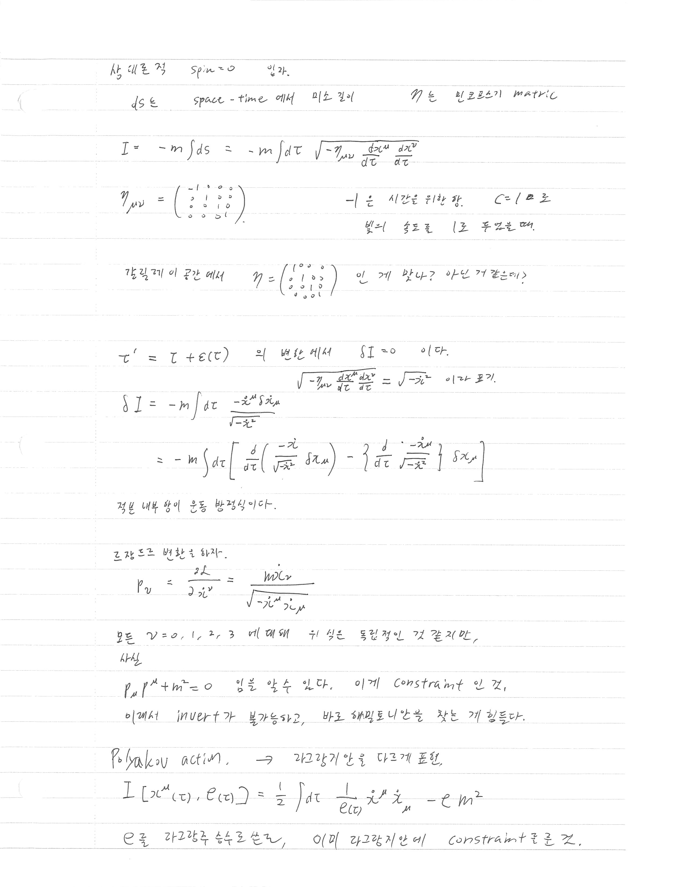
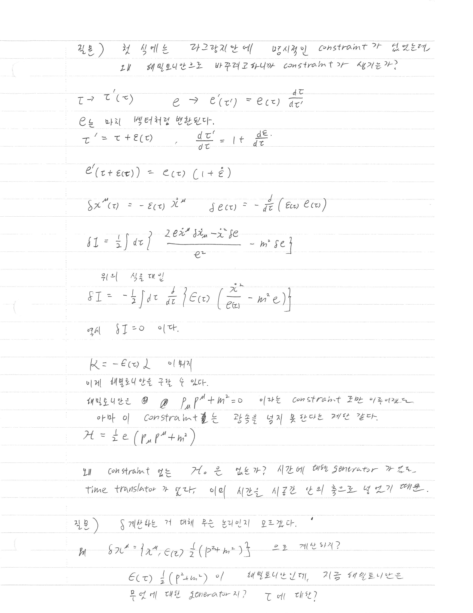
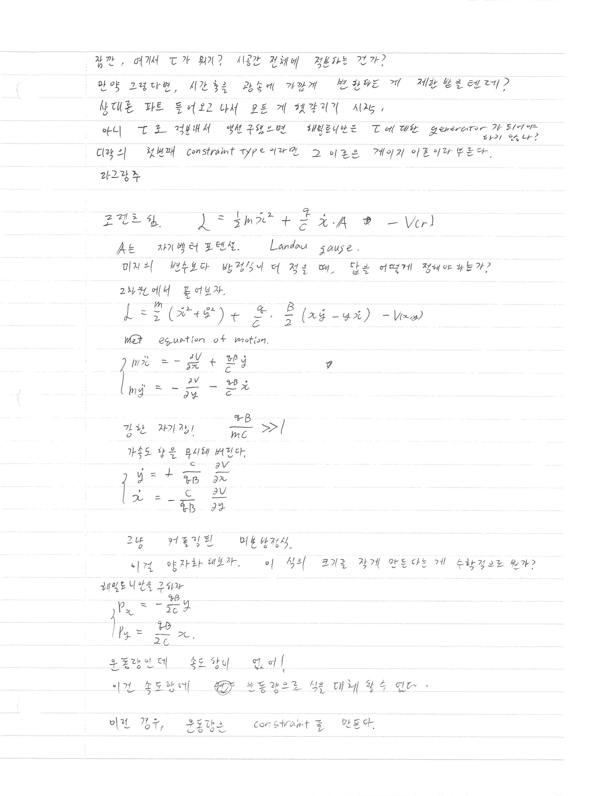
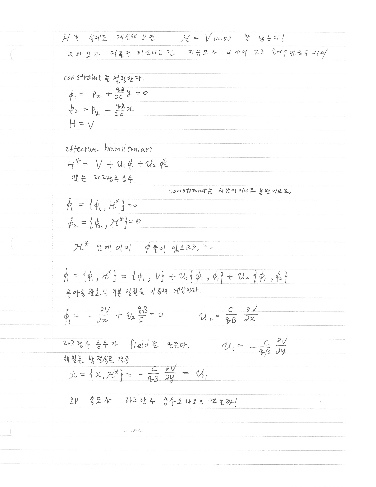
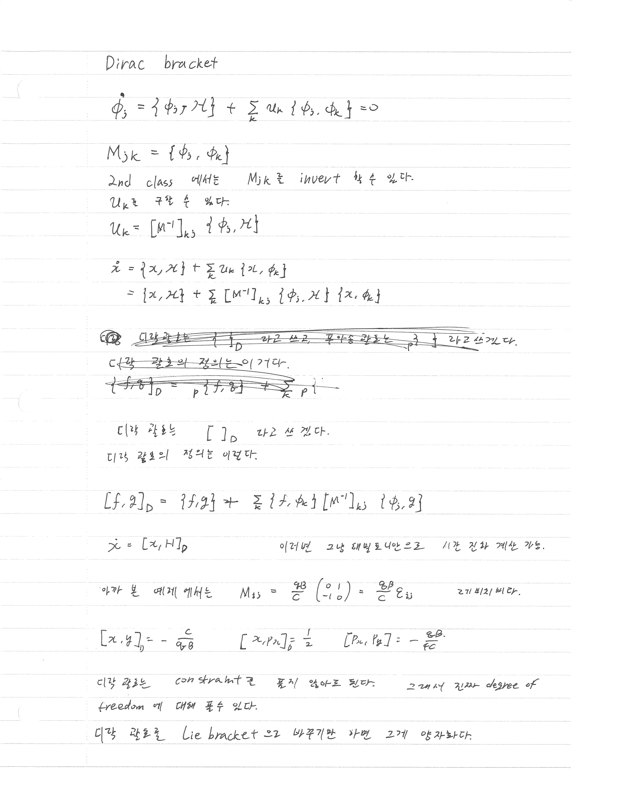
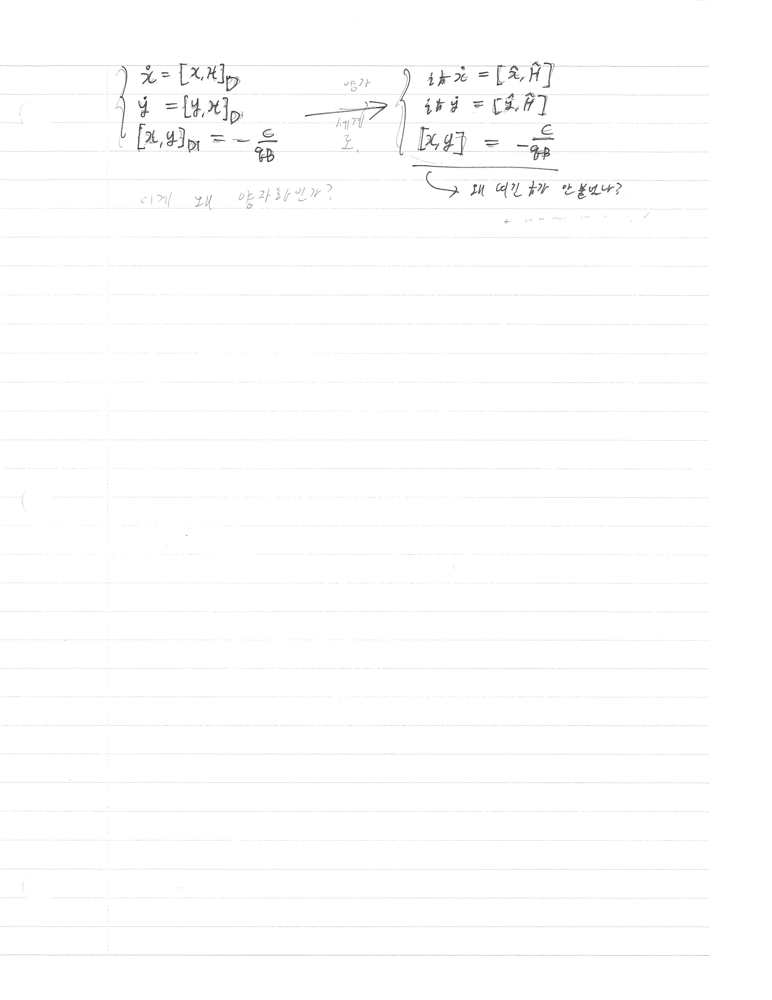

> [!attention] 강의 필기
> 이것은 [[Analytical Mechanics]] 강의를 듣고 적은 필기입니다. 
> 정리가 안 되어 있고, 개인적인 생각과 풀이가 섞여 있을 수도 있습니다. 

# 지난 강의

[[AM lecture note - Constrained systems examples]]

# 오늘의 핵심

- **Polyakov action**: 상대론적 입자의 Nambu-Goto action을 constraint를 통해 이차형식으로 재표현 — einbein $e(\tau)$를 Lagrange 승수로 도입
- **Landau problem**: 강한 균일 자기장 속 2D 입자 — 고속도 한계에서 운동량이 constraint가 되는 2nd class constraint system
- **Dirac bracket**: 2nd class constraint를 풀지 않고 constraint surface 위에서 올바른 시간 진화를 기술하는 수정된 Poisson bracket
- **양자화 연결**: Dirac bracket을 Lie bracket으로 바꾸면 양자역학이 된다

# 필기 내용

## 상대론적 자유 입자 (복습 및 Polyakov action)

> [!note] 배경
> 스핀이 없는 상대론적 자유 입자. $ds$는 시공간에서의 미소 길이, $\eta$는 Minkowski metric.

### Nambu-Goto 형태의 action

$$
I = -m\int ds = -m\int d\tau\, \sqrt{-\eta_{\mu\nu}\frac{dx^\mu}{d\tau}\frac{dx^\nu}{d\tau}}
$$

Minkowski metric:

$$
\eta_{\mu\nu} = \begin{pmatrix} -1 & 0 & 0 & 0 \\ 0 & 1 & 0 & 0 \\ 0 & 0 & 1 & 0 \\ 0 & 0 & 0 & 1 \end{pmatrix}
$$

시간 성분에 $-1$이 붙는 이유: $c = 1$ 단위에서, 빛의 속도를 1초 동안 두었을 때.

> [!question] 궁금한 내용
> 갈릴레이 공간에서는 metric이 $\eta = \text{diag}(1,1,1,1)$ 이 된다고 했는데, 이게 맞나? 아닌 거 같은데...

### 정준 운동량과 constraint

$$
p_\nu = \frac{\partial \mathcal{L}}{\partial \dot{x}^\nu} = \frac{m\dot{x}_\nu}{\sqrt{-\dot{x}^\mu \dot{x}_\mu}}
$$

모든 $\nu = 0,1,2,3$에 대해 위 식은 독립적인 것 같지만, 사실

$$
p_\mu p^\mu + m^2 = 0
$$

이 성립함을 알 수 있다. 이것이 **constraint**인 것,  
이래서 invert가 불가능하고, 바로 Hamiltonian을 찾는 게 힘들다.

> [!question] 궁금한 내용
> Invert가 안 된다는 게 무슨 말이지지

---
그래서 우리는 다른 표현 방식의 라그랑지만이 필요하다. 

### Polyakov action

라그랑지안을 다르게 표현. **einbein** $e(\tau)$를 도입하여:

$$
I\left[x^\mu(\tau),\, e(\tau)\right] = \frac{1}{2}\int d\tau\left(\frac{1}{e(\tau)}\dot{x}^\mu \dot{x}_\mu - e\, m^2\right)
$$

$e$를 라그랑주 승수로 쓰면, 이 라그랑지안에 constraint가 포함된 것.

> [!note] 첫 번째 질문
> 첫 식에는 라그랑지안 안에 명시적인 constraint가 없었는데, 해밀토니안으로 바꾸려고 하니까 constraint가 생기는가?

$\tau \to \tau'(\tau)$일 때 $e \to e'(\tau') = e(\tau)\frac{d\tau}{d\tau'}$

$e$는 마치 벡터처럼 변환된다.

$$
\tau' = \tau + \varepsilon(\tau), \quad \frac{d\tau'}{d\tau} = 1 + \dot{\varepsilon}
$$

$$
e'(\tau + \varepsilon(\tau)) = e(\tau)(1 + \dot{\varepsilon})
$$

Polyakov action의 변분: $\delta x^\mu(\tau) = -\varepsilon(\tau)\dot{x}^\mu$, $\delta e(\tau) = -\frac{d}{d\tau}(\varepsilon(\tau)\, e(\tau))$

$$
\delta I = \frac{1}{2}\int d\tau \left\{\frac{2e\dot{x}^\mu \delta\dot{x}_\mu - \dot{x}^2 \delta e}{e^2} - m^2 \delta e\right\}
$$

위의 식을 대입하면:

$$
\delta I = -\frac{1}{2}\int d\tau\, \frac{d}{d\tau}\left\{\varepsilon(\tau)\left(\frac{\dot{x}^2}{e(\tau)} - m^2 e\right)\right\}
$$

역시 $\delta I = 0$ 이다.

**$\delta I / \delta e = 0$으로부터**:

$$
\frac{\dot{x}^2}{e^2} - m^2 = 0 \quad \Rightarrow \quad e = \sqrt{-\dot{x}^2}/m
$$

이를 다시 대입하면 Nambu-Goto action을 복원한다.

### Polyakov에서 Hamiltonian

$\mathcal{K} = -\varepsilon(\tau)\mathcal{L}$이 뭐지...

이제 Hamiltonian을 구할 수 있다.  
Hamiltonian은 $p_\mu p^\mu + m^2 = 0$이라는 constraint만 이루어진 것.  
아마 이 constraint 항은 속도가 광속을 넘지 못한다는 제한 같다.

$$
\mathcal{H} = \frac{1}{2}e\left(p_\mu p^\mu + m^2\right)
$$

왜 constraint 없는 $\mathcal{H}_0$는 없는가? 
시간에 대한 generator가 없다는 뜻이라고 한다. 
**time translator**가 없다. 이미 시간을 시공간 안의 하나의 축으로 넣었기 때문이라고 하는데???
아니 위상공간에서 축이 있으면 한 축을 이루는 변수에 대한 translator는 당연히 있어야 하는 거 아닌가? 정의될 수 있는 거 아닌다. 

디락의 첫번째 constraint type이라면 그 이론은 게이지 이론이라 부른다.

> [!question] 궁금한 내용
> $\delta$ 계산하는 거 대체 무슨 논리인지 모르겠다.  
> 예) $\delta x^\mu = \{x^\mu, \varepsilon(\tau)\frac{1}{2}(p^2 + m^2)\}$ 으로 계산되지?  
> $\varepsilon(\tau)\frac{1}{2}(p^2+m^2)$이 Hamiltonian인데, 지금 Hamiltonian은 무엇에 대한 generator지? $\tau$에 대한?

> [!question] 궁금한 내용 (계속)
> 잠깐, 여기서 $\tau$가 뭐기? 시공간 전체에 정의되는 건가?  
> 만약 그렇다면, 시간 흐름을 광속에 가깝게 변환하는 게 제한 없을 텐데?  
> 상대론 파트 들어오고 나서 모든 게 헷갈리기 시작.  
> 아니 $\tau$로 적분해서 액션 구하면 Hamiltonian은 $\tau$에 대한 generator가 되어야 하지 않나?  

---

## Landau problem: 강한 자기장 속 2D 입자

### 조건 설정

라그랑지안. $\mathbf{A}$는 자기벡터 포텐셜. Landau gauge.

$$
\mathcal{L} = \frac{m}{2}(\dot{\mathbf{x}}^2) + \frac{q}{c}\dot{\mathbf{x}}\cdot\mathbf{A} - V(r)
$$

미지의 변수보다 방정식이 더 적을 때, 답은 어떻게 정해야 하는가?

2차원에서 풀어보자:

$$
\mathcal{L} = \frac{m}{2}(\dot{x}^2 + \dot{y}^2) + \frac{q}{c}\cdot\frac{B}{2}(x\dot{y} - y\dot{x}) - V(x,y)
$$

### 운동방정식 (Euler-Lagrange)

$$
m\ddot{x} = -\frac{\partial V}{\partial x} + \frac{qB}{c}\dot{y}
$$

$$
m\ddot{y} = -\frac{\partial V}{\partial y} - \frac{qB}{c}\dot{x}
$$

### 강한 자기장 극한: $\frac{qB}{mc} \gg 1$

가속도 항을 무시해 버린다:

$$
\dot{y} = +\frac{c}{qB}\frac{\partial V}{\partial x}
$$

$$
\dot{x} = -\frac{c}{qB}\frac{\partial V}{\partial y}
$$

그냥 커플링된 미분방정식.  
이건 **양자화** 해보자. 이 식의 크기를 작게 만든다는 게 수학적으로 뭔가?

### Hamiltonian 구하기

$$
p_x = -\frac{qB}{2c}y
$$

$$
p_y = \frac{qB}{2c}x
$$

운동하는데 속도 항이 없이!  
이건 속도항을 운동량으로 식을 대체할 수 있다.

**이건 경우, 운동량은 constraint를 만든다.**

---

## 2nd Class Constraint와 Dirac Bracket

### Constraint 설정

$$
\phi_1 = p_x + \frac{qB}{2c}y = 0
$$

$$
\phi_2 = p_y - \frac{qB}{2c}x
$$

$$
H = V
$$

### Effective Hamiltonian

$$
H^* = V + u_1\phi_1 + u_2\phi_2
$$

$u$는 라그랑주 승수.

constraint는 시간이 지나도 보존이므로:

$$
\dot{\phi}_1 = \{\phi_1, H^*\} = 0
$$

$$
\dot{\phi}_2 = \{\phi_2, H^*\} = 0
$$

$H^*$ 안에 이미 $\phi$들이 있으므로,

$$
\dot{\phi}_1 = \{\phi_1, H^*\} = \{\phi_1, V\} + u_1\{\phi_1, \phi_1\} + u_2\{\phi_1, \phi_2\}
$$

푸아송 괄호의 기본 성질을 이용해 계산하라:

$$
\dot{\phi}_1 = -\frac{\partial V}{\partial x} + u_2\frac{qB}{c} = 0 \quad \Rightarrow \quad u_2 = \frac{c}{qB}\frac{\partial V}{\partial x}
$$

라그랑주 승수가 field를 만든다:

$$
u_1 = -\frac{c}{qB}\frac{\partial V}{\partial y}
$$

해밀톤 방정식론 검증:

$$
\dot{x} = \{x, H^*\} = -\frac{c}{qB}\frac{\partial V}{\partial y} = u_1
$$

왜 속도가 라그랑주 승수로 나오는 거는 거지!

---

### Dirac Bracket

$$
\dot{\phi}_j = \{\phi_j, H\} + \sum_k u_k\{\phi_j, \phi_k\} = 0
$$

$$
M_{jk} = \{\phi_j, \phi_k\}
$$

2nd class에서는 $M_{jk}$를 invert할 수 있다.  
$u_k$를 구할 수 있다:

$$
u_k = [M^{-1}]_{kj}\{\phi_j, H\}
$$

아무 변수 z에 대해, 이것의 시간 미분은 이렇게 구할 수있다. 
방금 구한 $u_k$를 대입한다. 
$$
\dot{z} = \{z, H\} + \sum_k u_k\{z, \phi_k\}
$$

$$
= \{z, H\} + \sum_k [M^{-1}]_{kj}\{\phi_j, H\}\{z, \phi_k\}
$$

> [!note] 핵심 아이디어
> 디락 괄호는 $[\cdot]_D$ 라고 쓰고, 푸아송 괄호는 $\{\cdot\}$으로 라고 쓰겠다.  
> 디락 괄호의 정의는 이거다.

$$
[f, g]_D = \{f, g\} + \sum_k \{f, \phi_k\}[M^{-1}]_{kj}\{\phi_j, g\}
$$

$$
\dot{x} = [x, H]_D \quad \text{이러면 그냥 Hamiltonian으로 시간 진화 계산 가능.}
$$

아까 본 예제에서는:

$$
M_{jk} = \frac{qB}{c}\begin{pmatrix} 0 & 1 \\ -1 & 0 \end{pmatrix} = \frac{qB}{c}\varepsilon_{jk} \quad \text{레비치비타 이용}
$$

$$
[x, y]_D = -\frac{c}{qB} \qquad [x, p_x]_D = \frac{1}{2} \qquad [p_x, p_y] = -\frac{qB}{4c}
$$

**Dirac 괄호는 constraint를 풀지 않아도 된다.** 그래서 진짜 degree of freedom에 대해 풀 수 있다.

**Dirac 괄호를 Lie bracket으로 바꾸면 그게 양자화이다.**

### 양자화와의 연결

$$
\left\{\dot{x} = [x, H]_D\right\} \xrightarrow{\text{양자화}} \left\{i\hbar\dot{x} = [\hat{x}, \hat{H}]\right\}
$$

$$
[x, y]_D = -\frac{c}{qB} \xrightarrow{\text{양자화}} [\hat{x}, \hat{y}] = -\frac{i\hbar c}{qB}
$$

# 궁금한 내용

- $\delta$ 변분 계산에서 $\delta x^\mu = \{x^\mu, \varepsilon(\tau)\frac{1}{2}(p^2 + m^2)\}$ 계산의 논리적 구조
- 여기서 $\tau$가 뭐기? 시공간 전체에 정의되는 건가? 상대론에서 Hamiltonian은 $\tau$에 대한 generator인가, 아닌가?
- 강한 자기장 극한에서 속도가 라그랑주 승수로 나오는 이유 — 물리적으로 어떻게 이해할 것인가?
- $[x, y]_D = -\frac{c}{qB}$를 양자화할 때 왜 $i\hbar$가 안 붙는가?

# AI의 보충 설명

> [!note] Glia의 보충 (2026-03-24): 갈릴레이 공간의 metric
> 
> 엄밀히 말하면 $\eta = \text{diag}(1,1,1,1)$은 **아니야.** 갈릴레이 시공간에는 단일한 4차원 metric이 없어 — 시간과 공간이 독립적으로 각각 $dt^2$, $d\mathbf{x}^2$으로 측정되고, 둘을 합치는 단일 계량이 정의되지 않아.
> 
> $\text{diag}(1,1,1,1)$는 **유클리드 4차원 공간**의 계량으로, 상대론적 맥락에서는 **Euclidean signature** (시간을 허수로 Wick rotation했을 때)를 의미해.

> [!note] Glia의 보충 (2026-03-24): Invert가 안 된다는 의미
> 
> $p_\nu = \frac{m\dot{x}_\nu}{\sqrt{-\dot{x}^2}}$에서 **$\dot{x}^\nu$를 $p_\nu$의 함수로 역산하려고 하면 막힌다**는 뜻이야.
> 
> Legendre 변환의 핵심은 $\dot{q} \mapsto p$를 뒤집어 $\dot{q}(p)$를 구하는 건데, $p_\mu p^\mu + m^2 = 0$이라는 조건이 4개의 $p_\mu$ 사이의 관계를 묶어버려. 즉 자유도가 4개인 것 같지만 실제로는 3개야. **Jacobian $\partial p_\mu / \partial \dot{x}^\nu$의 행렬식이 0**이 되어 역함수가 없어지고, Hamiltonian을 직접 구할 수 없게 된다.

> [!note] Glia의 보충 (2026-03-24): $\tau$와 $\mathcal{H}_0 = 0$의 이유
> 
> 핵심은 **$\tau$ 자체가 물리적인 시간이 아니라는 것**이야. 상대론적 입자에서 $\tau$는 경로를 parametrize하는 편의상의 매개변수이고, $t, x, y, z$는 전부 동등한 좌표로 다뤄져.
> 
> 그래서 $\tau \to f(\tau)$로 자유롭게 재정의해도 물리가 바뀌지 않는 대칭(reparametrization invariance)이 있어. 이 대칭이 바로 Dirac 1st class constraint를 만들고, $\mathcal{H}_0 = 0$이 되는 이유야.
> 
> "위상공간에 축이 있으면 그 generator가 있어야 하지 않냐"는 직관은 맞지만, 이 경우엔 $t$가 위상공간의 **좌표로 들어가 있어** — 즉 외부의 절대 시간이 사라진 것이야. generator가 없는 게 아니라, $\tau$에 대한 generator가 $\mathcal{H} = \frac{1}{2}e(p^2+m^2)$이고, constraint surface 위에서 이것이 0이 되는 거야.

> [!note] Glia의 보충 (2026-03-24): 속도가 라그랑주 승수로 나오는 이유
> 
> Landau problem 극한에서는 운동량 $p_x, p_y$가 속도 $\dot{x}, \dot{y}$를 완전히 잃어버리고 위치 $x, y$만의 함수가 되어버려. 그러면 $\dot{x} = \{x, H^*\}$를 계산했을 때 결과가 자연스럽게 $u_1$과 같아지는 거야.
> 
> 물리적으로는: **강한 자기장 극한에서 입자는 가속되지 못하고 등속 드리프트만 한다 (Hall drift)**. 가속도가 0인 극한에서 입자의 속도는 전적으로 외부 퍼텐셜 $V$의 기울기로만 결정되고, 이것이 라그랑주 승수 $u_1, u_2$로 나타나는 거야.

# 연관 학습 노트

# References

David Tong, Classical Dynamics lecture notes

# 다음 강의

[[AM lecture note - Liouville theorem and Canonical transformation]]

# 필기 원본

[[AM_4thweek_3.pdf]]

---

## 필기 스캔본 이미지

